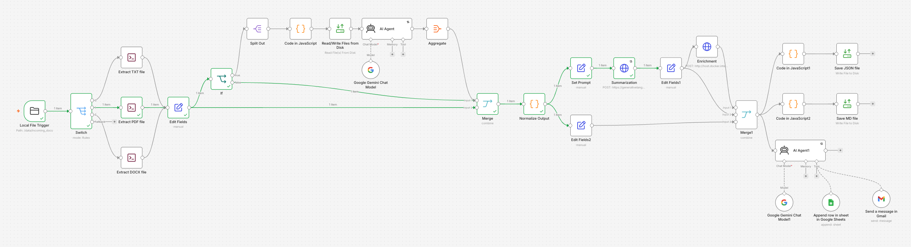
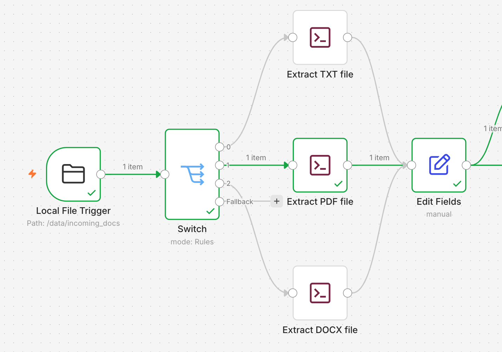
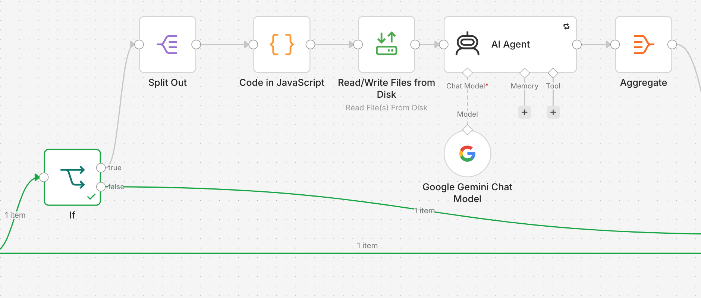
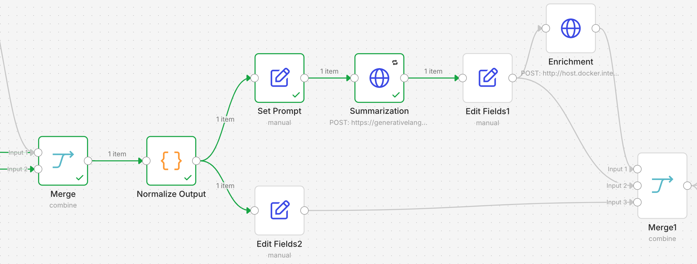
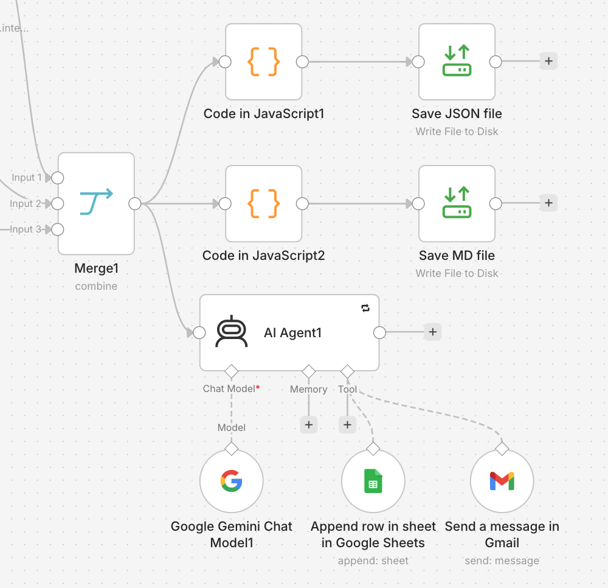

# N8N_PROJECT

Document processing pipeline built with **n8n**, **Python**, **Gemini**, and custom enrichment services.

## Prerequisites

* Docker
* Python 3.10+
* Git

---

## Installation

### 1. Clone the Repository

```bash
git clone https://github.com/sassonshmuel/N8N_PROJECT.git
cd N8N_PROJECT
```

### 2. Build the Custom n8n Docker Image

The project uses **n8n running in Docker**. Since the standard n8n image does not include Python, build the custom image first:

```bash
./build_docker.sh
```

### 3. Create Required Directories

Create the folders used for document ingestion and generated outputs:

```bash
mkdir -p incoming_docs
mkdir -p output_docs
```

### 4. Configure Permissions

Grant write permissions to the output directory so n8n can generate files successfully:

```bash
chmod -R 777 /PATH/TO/PROJECT/output_docs
```

Replace `/PATH/TO/PROJECT` with your actual project path.

---

## Running n8n

Start the n8n container:

```bash
./run_n8n.sh
```

Once started, open:

```text
http://localhost:5678
```

---

## Running the Enrichment Service

The enrichment API is located in the `server/` directory.

### 1. Navigate to the Server Folder

```bash
cd server
```

### 2. Install Dependencies

```bash
pip install -r requirements.txt
```

### 3. Start the Service

```bash
python app.py
```

The enrichment endpoint should now be available for n8n workflows.

---

# Workflow Overview

## Complete Flow



---

## File Detection and Text Extraction

This stage detects the incoming document type and extracts textual content from supported formats.



---

## Image Extraction

Images embedded inside documents are extracted and prepared for Gemini Vision processing.



---

## Summarization and Enrichment

Document text and image analysis results are sent for AI-powered summarization and metadata enrichment.



---

## Google Sheets, Email, and File Output

Final results are distributed to downstream systems including Google Sheets, email notifications, and output files.



---

## Architecture Highlights

* Automated document ingestion using n8n
* Support for PDF, DOCX, TXT and image processing
* Text extraction using Python services
* Image extraction and Gemini Vision integration
* AI-powered document summarization
* Metadata enrichment endpoint
* Google Sheets integration
* Email notifications
* JSON and Markdown output generation
* Fully containerized n8n environment with Python support

## Results
 * The N8N project file json can be found in the project's root (Project.json).
 * The input and output files examples can be found in the results/ directory, input/ and output/ folders.
 * Google Spreadsheet: https://docs.google.com/spreadsheets/d/1qdYX2wKunzKnLlAaq9Nr1gZVk2xUQ0czOs3umLwRZWY/edit?usp=sharing